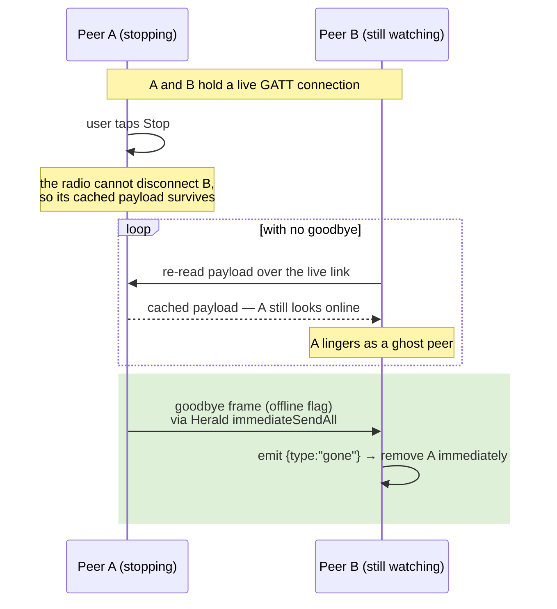
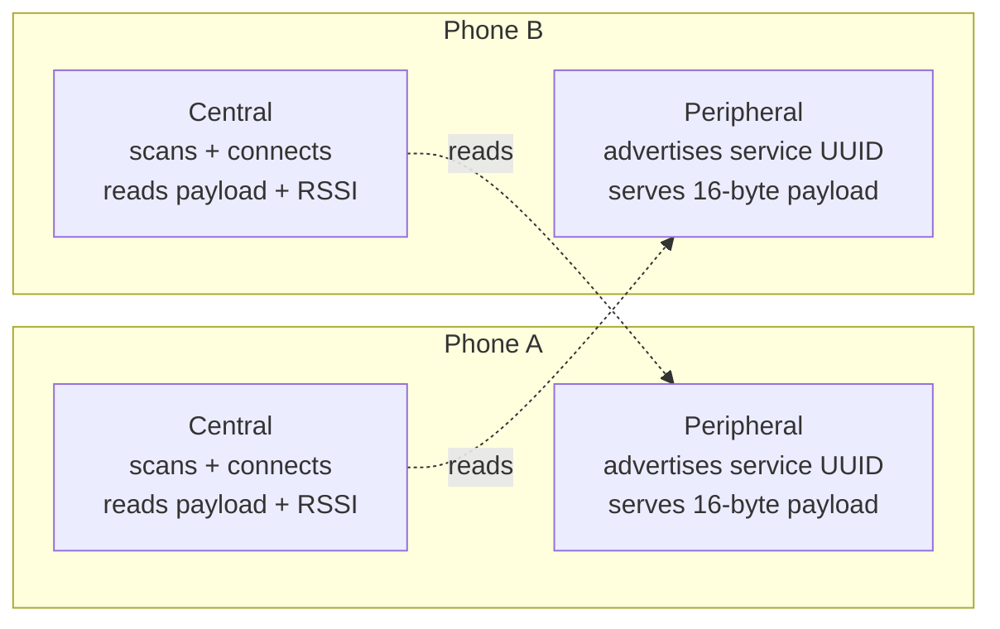
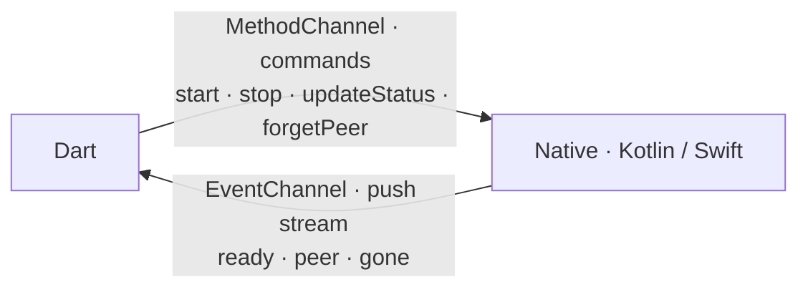
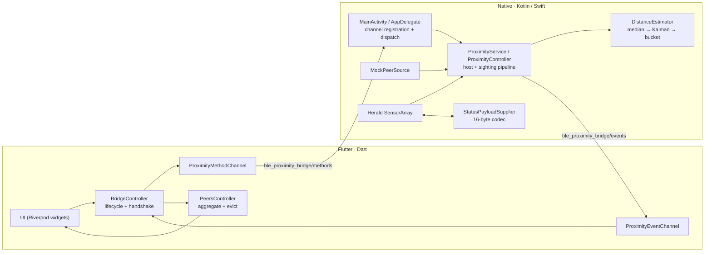
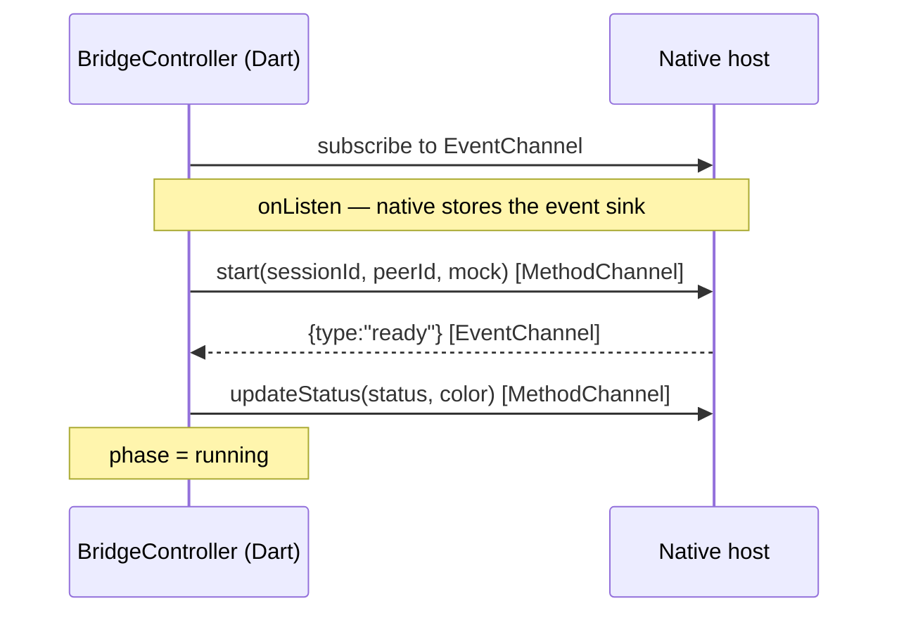

# Flutter ↔ Native BLE Proximity Bridge


A reference implementation of a **production-quality bridge between Flutter and
native BLE code** on Android and iOS. Each device broadcasts a small status
payload (an emoji status + a color) over Bluetooth Low Energy; nearby devices
discover each other and show a live list with smoothed distance estimates.

The project demonstrates the full path from Dart to Kotlin/Swift over platform
channels: a binary wire format shared byte-for-byte across both native
platforms, RSSI smoothed into displayable distance estimates, and the lifecycle
and threading handling that real BLE integrations require.

The BLE transport is the open-source [Herald](https://heraldprox.io) library
(Apache 2.0). Everything else — the channel design, the payload codec, the
distance pipeline, the threading and lifecycle handling — is implemented in
this repository and documented as reusable patterns.

## What this project demonstrates

The focus is the bridge itself rather than the demo UI on top of it. Each
pattern below addresses a problem that arises when native BLE sits behind a
Flutter interface, paired with an implementation that can be adapted directly.

| Pattern | Problem it solves | Where |
|---|---|---|
| Command channel + event stream split | Two-way bridge without tangling request/response and push semantics | [channel-contract.md](docs/channel-contract.md) |
| Ready handshake with replay | Dart must not race native initialization; late subscribers must not miss the signal | [architecture.md](docs/architecture.md) |
| Pending-sink handoff | Flutter can subscribe before the Android service exists | [android.md](docs/android.md) |
| Locked sink + main-thread delivery | BLE callbacks arrive on worker threads; Flutter sinks are main-thread-only and can detach at any time | both platform docs |
| Symmetric binary payload codec | One 16-byte wire format encoded/decoded identically in Kotlin and Swift | [channel-contract.md](docs/channel-contract.md) |
| Median → Kalman → bucket distance pipeline | Raw RSSI is far too noisy to display directly | [architecture.md](docs/architecture.md) |
| Single long-lived BLE host | BLE stacks neither stop cleanly on demand nor survive rebuild races | [architecture.md](docs/architecture.md#stopping-is-a-protocol-problem) |
| Protocol-level goodbye/hello | A stopped peripheral can't disconnect its centrals — peers would see a ghost | [architecture.md](docs/architecture.md#stopping-is-a-protocol-problem) |
| Foreground service for background BLE | Android kills background scanning without one | [android.md](docs/android.md) |
| Background modes + state restoration | iOS suspends apps; CoreBluetooth can relaunch them | [ios.md](docs/ios.md) |
| Transport-agnostic mock source | The full bridge runs on simulators with zero Bluetooth | [architecture.md](docs/architecture.md) |

## The hard problem: stopping cleanly

Most BLE examples stop at scan, connect, read a characteristic. The harder
problem — and the one this project is largely built around — is stopping
cleanly.

When a device stops, it should disappear from every other device's list. It
does not. A `CBPeripheralManager` (iOS) has no API to disconnect a central
already connected to it, and Herald holds those GATT connections open for
continuous RSSI. A "stopped" device therefore keeps serving its **cached**
payload over the surviving link, and peers continue to see it — a ghost peer
that lingers indefinitely.



The solution is to treat "stopped" as a protocol state rather than a radio
state: the device flags its payload offline and pushes a goodbye frame to every
connected peer, with staleness eviction as a fallback for peers that crashed or
moved out of range. The full reasoning — including why the Herald host must be
reused rather than rebuilt — is in
[architecture.md → Stopping is a protocol problem](docs/architecture.md#stopping-is-a-protocol-problem).

## Background concepts

The two collapsible sections below summarize the Bluetooth Low Energy and
platform-channel concepts that the rest of the document assumes. Skip them if
the material is already familiar and continue to
[Architecture at a glance](#architecture-at-a-glance).

<details>
<summary><b>Bluetooth Low Energy concepts</b> — central/peripheral roles, GATT, RSSI, and why RSSI isn't distance</summary>

<br/>

**Central and peripheral.** In BLE, a *peripheral* advertises its presence and
serves data, while a *central* scans for advertisements, connects, and reads
data — a heart-rate strap is a peripheral, the phone reading it is a central.
In this application every device acts as **both simultaneously**: advertising
itself and scanning for others. Herald runs both roles concurrently.



**GATT and the payload.** Once connected, devices exchange data through **GATT**
(Generic Attribute Profile): a peripheral exposes *services*, each containing
*characteristics* — named values that can be read, written, or subscribed to.
Herald abstracts most of this away. The relevant term is *payload*: the small
block of bytes a peer serves to any device that reads it. Here the payload is a
fixed **16 bytes** — a peer id, a status, a color, the originating platform, a
flags byte, and a protocol version.

**Service UUID as a discovery filter.** A BLE service is identified by a UUID.
This project uses the *session id* as the advertised service UUID, so a central
only discovers peripherals advertising that same UUID. Devices sharing a session
id find each other; devices with different ids are mutually invisible. This
scopes discovery to devices running the app in the same session.

**RSSI is signal strength, not distance.** Each time a central detects a
peripheral it receives an **RSSI** value (Received Signal Strength Indicator, in
dBm — a negative number such as `-65`). Shorter distances tend to produce a
stronger (less negative) signal, which makes RSSI the only distance cue BLE
provides. It is also **highly noisy**: reflections, a hand over the antenna,
body shadowing, and radio-chip differences move it by several dB at a *fixed*
distance. Two devices 30 cm apart can briefly report the same RSSI as two
devices 3 m apart. For that reason the app never displays raw meters — it
smooths RSSI heavily and maps the result to coarse buckets (*Immediate / Near /
Medium / Far*). RSSI alone does not support metre- or centimetre-level distance.
See [Distance estimation](docs/architecture.md#distance-estimation).

</details>

<details>
<summary><b>Platform channels</b> — MethodChannel vs EventChannel, and the contract across the language boundary</summary>

<br/>

Dart cannot call Kotlin or Swift directly. The two sides exchange
**asynchronous messages** over named **platform channels**, with the Flutter
engine serializing arguments through a standard codec (ints, doubles, strings,
bools, lists, maps). Two channel types exist, each suited to a different
interaction shape.



- **`MethodChannel` — request/response.** Dart invokes a named method and awaits
  a single result or error. Suited to **commands** ("start", "stop", "update
  status"): low frequency, each call expects a reply.
- **`EventChannel` — one-way stream.** Native pushes events, Dart listens.
  Suited to **telemetry** (a peer was seen, a peer left): high frequency,
  bursty, fire-and-forget, started and stopped with the BLE stack.

Routing both shapes through a single mechanism leads to either polling or
synthetic "responses", so this bridge uses **one of each**: a MethodChannel for
outbound commands and an EventChannel for the inbound stream. See
[the two-channel design](docs/architecture.md#the-two-channel-design).

**There is no compile-time checking across the boundary.** The channel name
`"ble_proximity_bridge/methods"`, the method name `"start"`, and the argument
key `"sessionId"` are plain strings that must match on both sides; a mismatch
surfaces only at runtime. The safeguards are a single constants file per
language, the [contract document](docs/channel-contract.md), and a Dart test
that pins the wire names ([channel-contract test](test/proximity_method_channel_test.dart)).

> **On Pigeon.** [Pigeon](https://pub.dev/packages/pigeon) code-generates
> type-safe channel bindings and is the appropriate choice for most production
> apps. The channels here are written by hand deliberately: seeing the
> underlying mechanics — the sink lifecycle, the codec edge cases, the
> threading — makes Pigeon's generated output legible rather than opaque.

</details>

## Why Herald

[Herald](https://heraldprox.io) is an open-source (Apache 2.0) BLE proximity
library, originally built for COVID-19 contact tracing — a context that demanded
reliable phone-to-phone detection across iOS and Android, including in the
background. That heritage maps directly onto the requirements of a proximity
app. Building equivalent functionality on raw `CoreBluetooth` / Android BLE — or
on a scanner-oriented package such as `flutter_blue_plus` — means reimplementing
the parts Herald already provides:

- **Symmetric central + peripheral** running at once, so every device both
  advertises and discovers — the half that single-role examples omit.
- **Continuous RSSI** sampling tied to a peer's payload, not a single reading at
  connect time.
- **A payload-supplier abstraction** (`PayloadDataSupplier`) — a clear seam for
  injecting a custom [16-byte format](docs/channel-contract.md#wire-payload-ble).
- **Payload sharing / relay** to work around iOS background advertising limits:
  a backgrounded iPhone stops advertising its service UUID in the normal packet,
  so two iPhones may not see each other directly — an Android device in range
  can relay payloads between them (Herald's `didShare`).

Herald is used strictly as the **transport**; the bridge, codec, and distance
logic are built on top. Replacing it with a different BLE library would affect
only the native host classes — the channel contract and the entire Dart side
are unaffected.

## Architecture at a glance



The system divides into four layers:

1. **UI + state (Riverpod).** Widgets render whatever the controllers hold and
   never touch a channel directly.
2. **Bridge wrappers.** `ProximityMethodChannel` / `ProximityEventChannel` are
   thin typed wrappers over the raw channels, keeping the string names in one
   place and allowing tests to inject fakes.
3. **The channels.** One `MethodChannel` carries commands out (`start`, `stop`,
   `updateStatus`, `forgetPeer`); one `EventChannel` streams events back
   (`ready` handshake, `peer` sightings, `gone` goodbyes).
4. **Native host + transport.** The host feeds both the real Herald stack and
   the mock source through the **same** sighting pipeline, so everything
   downstream — distance estimation, threading, event encoding, Dart state,
   UI — is identical regardless of transport. This is what makes mock mode a
   genuine exercise of the whole bridge rather than a bypass of it.

## The start handshake

`start` returning `true` indicates only that the native side **accepted** the
request — BLE initialization continues asynchronously. Dart must not push a
status update into a half-initialized stack, so readiness is signaled
explicitly with a `ready` event, and Dart waits for it (with a timeout) before
proceeding.



Dart subscribes **before** calling `start` so the `ready` event cannot be
missed, and native **re-sends** `ready` to any late subscriber (hot restart,
app resume). The handshake is therefore race-proof from both ends; the full
treatment, including the ordering analysis, is in
[architecture.md → The ready handshake](docs/architecture.md#the-ready-handshake).

## Requirements & setup

| Platform | Minimum OS | Real BLE? | Runs mock mode? |
|---|---|---|---|
| Android phone | 7.0 (API 24, this app's `minSdk`; Herald itself supports API 21+) | ✅ yes | ✅ yes |
| Android emulator | — | ❌ no BLE radio | ✅ yes |
| iPhone | iOS 15.5+ | ✅ yes | ✅ yes |
| iOS simulator | — | ❌ no Bluetooth at all | ✅ yes |

Toolchain: a recent **Flutter 3.x** (Dart SDK `^3.12.0`; the iOS integration
uses the `FlutterImplicitEngineDelegate` scene lifecycle, which requires a
current Flutter release), Xcode 26 / CocoaPods for iOS, Android Studio / SDK
for Android.

```bash
flutter pub get
flutter run            # Android: also runs on an emulator (mock mode)
```

For iOS, install pods once (Flutter usually does this on the first build):

```bash
cd ios && pod install
```

> **Note for iOS builds:** Herald 2.2.0 trips the Swift 6.3+ (Xcode 26)
> type-checker on one statistics file. The `Podfile` carries a `post_install`
> hook (`patch_herald_for_swift6`) that decomposes the offending expressions —
> it runs automatically during `pod install`, is mathematically identical, and
> self-disables once Herald ships a fix. Details in
> [ios.md → The Herald build patch](docs/ios.md#the-herald-build-patch).

## Running the demo

**Mock mode (no hardware, any simulator or emulator).** In debug builds the
**Mock peers** toggle is on by default: press **Start** and three synthetic
peers appear with drifting distance estimates — no Bluetooth, no permissions.
Because the mock source feeds the real bridge pipeline, this exercises the
channels, codec path, threading, and Dart state end to end.

**Real BLE (two physical devices).** Run the app on **two phones**, switch the
mock toggle off, and press **Start** on both. Grant the Bluetooth permissions
when prompted. Both devices use the same demo session id (`kDemoSessionId`) and
discover each other automatically — select different statuses and colors,
observe them propagate, then move the devices apart and watch the distance
bucket change.

## Repository layout

```
lib/src/bridge/      Channel names (the contract) + typed channel wrappers
lib/src/models/      Peer, sighting events, broadcast status
lib/src/providers/   Riverpod: bridge lifecycle, peer aggregation, status
lib/src/ui/          Example UI: status picker, peer list, permissions
android/.../         MainActivity, ProximityService, codec, estimator, mock   ┐ mirror
ios/Runner/          AppDelegate, ProximityController, codec, estimator, mock  ┘ each other
docs/                Architecture, channel contract, platform deep-dives
test/                Event decoding + channel contract + bridge tests
```

The Android and iOS folders are deliberate mirrors: `ProximityService.kt` ↔
`ProximityController.swift`, `StatusPayloadSupplier.kt` ↔ `.swift`,
`DistanceEstimator.kt` ↔ `.swift`, and so on. Reading a file on one platform
indicates what to look for on the other.

## Where to start reading

Each entry lists the files to read in order for a given topic, arranged from the
most approachable to the most involved.

- **Run the demo.** Run mock mode, then read
  [`home_screen.dart`](lib/src/ui/home_screen.dart) for how the UI drives
  start/stop and renders the peer list.
- **Dart → native commands.** Follow
  [`channel_names.dart`](lib/src/bridge/channel_names.dart) →
  [`proximity_method_channel.dart`](lib/src/bridge/proximity_method_channel.dart)
  → [`bridge_provider.dart`](lib/src/providers/bridge_provider.dart) → the
  `handleStart` dispatch in
  [`MainActivity.kt`](android/app/src/main/kotlin/com/example/ble_proximity_bridge/MainActivity.kt)
  / [`AppDelegate.swift`](ios/Runner/AppDelegate.swift).
- **Native → Dart events.** Read
  [`proximity_event_channel.dart`](lib/src/bridge/proximity_event_channel.dart)
  and [`bridge_event.dart`](lib/src/models/bridge_event.dart), then the sighting
  pipeline and `emit`/sink handling in
  [`ProximityService.kt`](android/app/src/main/kotlin/com/example/ble_proximity_bridge/ProximityService.kt)
  / [`ProximityController.swift`](ios/Runner/ProximityController.swift).
- **Payload encoding.** Compare
  [`StatusPayloadSupplier.kt`](android/app/src/main/kotlin/com/example/ble_proximity_bridge/StatusPayloadSupplier.kt)
  and [`StatusPayloadSupplier.swift`](ios/Runner/StatusPayloadSupplier.swift)
  against the [wire format table](docs/channel-contract.md#wire-payload-ble).
- **Distance estimation.**
  [`DistanceEstimator`](android/app/src/main/kotlin/com/example/ble_proximity_bridge/DistanceEstimator.kt)
  and [`KalmanFilter1D`](android/app/src/main/kotlin/com/example/ble_proximity_bridge/KalmanFilter1D.kt),
  explained in [Distance estimation](docs/architecture.md#distance-estimation).
- **Lifecycle, threading, and clean shutdown.** [architecture.md](docs/architecture.md):
  the ready handshake, the threading model, lifecycle, and the
  [stop-is-a-protocol-problem](docs/architecture.md#stopping-is-a-protocol-problem)
  discussion, plus the platform deep-dives ([Android](docs/android.md),
  [iOS](docs/ios.md)).

## Testing

```bash
flutter test
```

The Dart tests cover the parts of the bridge that can be verified without a
radio:

- [`proximity_method_channel_test.dart`](test/proximity_method_channel_test.dart)
  pins the channel contract — each wrapper method invokes the agreed method name
  with the agreed argument keys. This is the closest the bridge has to a
  cross-language interface check.
- [`bridge_controller_test.dart`](test/bridge_controller_test.dart) drives the
  full Dart half end to end with the native side faked: the start sequence
  (subscribe → start → await ready → push status), peer ingestion, the immediate
  goodbye path, clean stop/restart, a rejected start, and an event stream that
  errors mid-handshake.
- [`bridge_event_test.dart`](test/bridge_event_test.dart) covers event decoding
  and the codec edge cases — including a whole-number `double` arriving from
  native as an `int` and being widened back.

## Adapting it for your own app

This is a **reference implementation**, not a published package. Points to
address when building on it:

- **Change the identifiers.** The `com.example.ble_proximity_bridge` application
  id / bundle id is a placeholder; set your own before shipping.
- **Mint real session ids.** The demo hard-codes one shared `kDemoSessionId` so
  every install finds every other. A real app mints a UUID per
  room/group/pairing and distributes it out of band.
- **Persist peer identity if required.** Peer ids are random per launch; persist
  one if peers must be recognized across restarts. The bridge does not depend on
  it.

Deliberate non-goals, which mark the boundaries of the implementation: no state
persistence, no retry/backoff beyond resume-retry, and no Pigeon (the channels
are hand-written to remain legible). The full list is in
[architecture.md → What is deliberately not here](docs/architecture.md#what-is-deliberately-not-here).

## Documentation

- [Architecture](docs/architecture.md) — bridge design, data flow, lifecycle, threading
- [Channel contract](docs/channel-contract.md) — every method, event, and wire byte
- [Android implementation](docs/android.md) — foreground service, permissions, the pending-sink race
- [iOS implementation](docs/ios.md) — background modes, state restoration, the Herald build patch

## License & credits

MIT — see [LICENSE](LICENSE). BLE transport by
[Herald](https://heraldprox.io), a separate project licensed under Apache 2.0
and fetched as a dependency, not vendored here.
