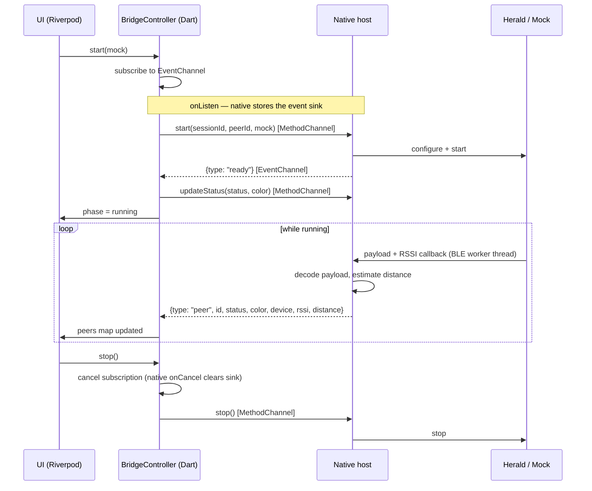
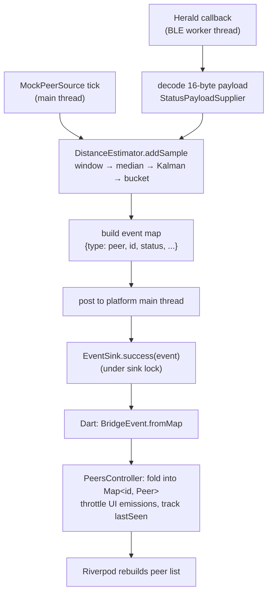

# Architecture

This document explains how the bridge is designed and why. The
[channel contract](channel-contract.md) specifies the exact wire details;
the [Android](android.md) and [iOS](ios.md) docs cover platform specifics.

## The two-channel design

Flutter ↔ native communication here has two very different shapes:

1. **Commands**: Dart tells the native side to do something and wants an
   answer (or an error). Request/response. Low frequency.
2. **Telemetry**: the native side discovers peers continuously and pushes
   them to Dart. Fire-and-forget. High frequency, bursty, starts and stops
   with the BLE stack.

Forcing both through one mechanism produces either polling (commands-only)
or awkward fake "responses" (stream-only). So the bridge uses one
`MethodChannel` for commands and one `EventChannel` for the stream — each
channel does the one thing it is good at.

## The ready handshake

`start` returning success only means the native side *accepted* the request
— BLE initialization continues asynchronously. Dart must not push payload
updates into a half-initialized native stack, so readiness is signaled
explicitly with a `{type: "ready"}` event.

Two orderings are possible, and both must work:

- **Dart subscribes first** (the normal path): the controller subscribes to
  the event stream *before* invoking `start`, so the ready event cannot slip
  through the gap.
- **Native is ready first** (hot restart, app resume, re-subscription): the
  native `onListen` checks whether a source is already running and
  *re-sends* ready to the new subscriber.

This "ready replay" makes the handshake immune to subscribe/start races
from either direction. Dart additionally puts a timeout on the wait so a
genuinely failed native start surfaces as an error instead of a hang.

## The sighting pipeline

Everything from "a peer was observed" onward is one code path, regardless
of whether the observation came from Herald or from the mock source:

This is the property that makes mock mode honest: it does not bypass the
bridge, it feeds it. If the threading, locking, codec, or channel plumbing
were broken, mock mode would break too.

## Distance estimation

Raw BLE RSSI at a fixed distance jitters by several dB from reflections,
body shadowing, and radio quirks. The pipeline tames it in three stages,
per peer:

1. **Sliding window** — keep up to 20 samples from the last 30 seconds.
2. **Median** — robust against single-sample outliers (a person walking
   between the phones).
3. **1-D Kalman filter** — smooths the median over time, weighting new
   measurements against accumulated confidence.

The smoothed RSSI is then mapped to a coarse bucket — *Immediate* (0.5 m),
*Near* (1.5 m), *Medium* (3.5 m), *Far* (8 m) — using cutoffs chosen by the
**sender's** platform: iPhone radios read noticeably hotter than typical
Android radios at the same distance, which is why the sender's device kind
travels inside the payload.

Buckets, not meters with decimals, are the honest output: BLE RSSI simply
does not contain centimeter-level information.

## Stopping is a protocol problem

The hardest bug this bridge handles: **stopping a BLE stack is not a clean
operation, and pretending it is produces ghosts.** Two facts, verifiable in
Herald 2.2.0's source and CoreBluetooth's API surface:

1. **Live connections outlast stop.** Herald keeps GATT connections to iOS
   peers open for continuous RSSI. A `CBPeripheralManager` has no API to
   disconnect an inbound central, and Herald's receiver-side cleanup is
   guarded by `central.isScanning` — a stop that lands between scan cycles
   skips it (and because the enabled flag is already cleared, scanning never
   resumes, so the guard stays false forever; retrying stop cannot help).
   Result: a peer that "stopped" keeps serving its **cached** payload over
   surviving connections, and other devices keep seeing it indefinitely.
2. **Rebuilding the stack races its own teardown.** Herald creates its
   CoreBluetooth managers with fixed state-restoration identifiers; iOS
   forbids two live managers sharing one. Creating a second `SensorArray`
   while the first is still unwinding yields an unreliable stack — the
   classic "stop, start, now nothing is discovered" failure.

The bridge therefore never fights the BLE layer. It applies two patterns:

**PATTERN: single long-lived BLE host.** The Herald `SensorArray` is created
at most once per process and reused: logical stop calls `stop()` on it,
logical start calls `start()` on the *same instance*. Herald's enabled-flags
are explicitly designed for this ("follow bluetooth state"). No second
manager is ever created, so restarts are reliable. Native callbacks are
gated by a source-mode flag while logically stopped, because surviving
connections keep delivering measurements.

**PATTERN: protocol-level goodbye/hello.** Since the radio cannot be
trusted to make us disappear, the *protocol* does it. The payload carries an
offline flag; on stop the device sets it and pushes the flagged payload to
every connected peer via Herald's immediate-send channel
(`immediateSendAll` — public API), then quiesces the host after a short
flush window. Receivers translate the flag into a `{type: "gone"}` event
and remove the peer instantly. On restart, an online hello reverses it.
Three safety nets back this up, in order of speed:

| Net | Covers | Latency |
|---|---|---|
| Goodbye/hello frame | Peers with live connections (the ghost case) | instant |
| Offline flag in payload re-reads | Peers that missed the frame | ≤ 15 s (`payloadDataUpdateTimeInterval`) |
| Dart staleness eviction | Peers that crashed / walked away and never said goodbye | 20 s threshold, swept every 5 s |

## Lifecycle

- **Start**: subscribe → invoke `start` → await ready (10 s timeout) → push
  current status → running.
- **Stop**: cancel subscription → invoke `stop` (tolerating "already
  stopped") → clear peer state → idle. Teardown is safe from any state
  because failures can leave the bridge half-started.
- **Resume retry**: a start can fail for reasons fixed *outside* the app —
  Bluetooth off, permission denied. The Dart controller remembers that a
  start was requested and retries automatically when the app returns to the
  foreground in an error state.
- **Peer departure**: cooperative peers announce a protocol-level goodbye
  (see above) and are removed instantly. The 20 s staleness eviction remains
  as the fallback for peers that never got to say it. Either way Dart drives
  the cleanup and calls `forgetPeer` so the native side frees that peer's
  distance model — otherwise per-peer state would grow forever.

## Threading model

| Layer | Where events originate | Where sinks are touched |
|---|---|---|
| Android | Herald BLE worker threads | `Handler(Looper.getMainLooper()).post { ... }`, sink under `synchronized(sinkLock)` |
| iOS | Herald dispatch queues | `DispatchQueue.main.async { ... }`, sink read under `NSLock` |
| Dart | Platform thread (delivered by engine) | Stream callbacks on the UI isolate |

Two invariants, enforced identically on both platforms:

1. **The sink is only invoked on the platform main thread.** Flutter
   requires it; violating it causes crashes that only appear under load.
2. **Every sink access is lock-protected and failure-tolerant.** The sink
   can be detached (`onCancel`, engine teardown) between a null-check and a
   call. If sending throws, the native side drops its reference rather than
   retrying into a dead sink.

## What is deliberately *not* here

- No state persistence: peer identity is per-launch. Persisting it is an
  application concern, not a bridge concern.
- No retry/backoff sophistication beyond resume-retry: production apps
  layer policy on top of the same primitives.
- No Pigeon: this repo demonstrates the raw channel mechanics that Pigeon
  generates for you. Understanding these makes Pigeon's output legible.
