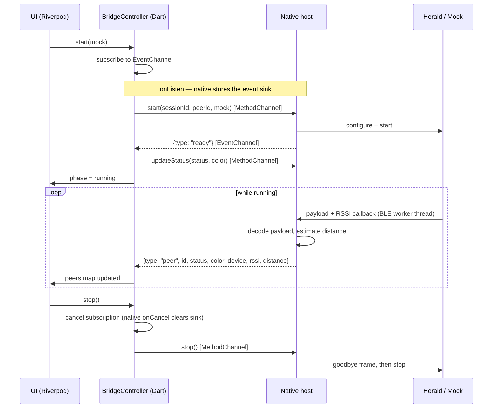
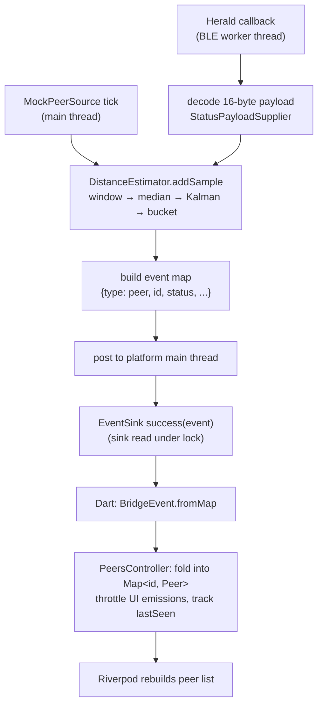

# Architecture

This document explains how the bridge is designed and why. The
[channel contract](channel-contract.md) specifies the exact wire details;
the [Android](android.md) and [iOS](ios.md) docs cover platform specifics.

## The two-channel design

Flutter ↔ native communication here has two very different shapes:

1. **Commands**: Dart tells the native side to do something and wants an
   answer (or an error). Request/response. Low frequency.
2. **Telemetry**: the native side discovers peers continuously and pushes
   them to Dart. Fire-and-forget. High frequency, bursty, starts and stops
   with the BLE stack.

Forcing both through one mechanism produces either polling (commands-only)
or awkward fake "responses" (stream-only). So the bridge uses one
`MethodChannel` for commands and one `EventChannel` for the stream — each
channel does the one thing it is good at.

```mermaid
sequenceDiagram
    participant UI as UI (Riverpod)
    participant BC as BridgeController (Dart)
    participant N as Native host
    participant H as Herald / Mock

    UI->>BC: start(mock)
    BC->>BC: subscribe to EventChannel
    Note over BC,N: onListen — native stores the event sink
    BC->>N: start(sessionId, peerId, mock)  [MethodChannel]
    N->>H: configure + start
    N-->>BC: {type: "ready"}  [EventChannel]
    BC->>N: updateStatus(status, color)  [MethodChannel]
    BC->>UI: phase = running

    loop while running
        H->>N: payload + RSSI callback (BLE worker thread)
        N->>N: decode payload, estimate distance
        N-->>BC: {type: "peer", id, status, color, device, rssi, distance}
        BC->>UI: peers map updated
    end

    UI->>BC: stop()
    BC->>BC: cancel subscription (native onCancel clears sink)
    BC->>N: stop()  [MethodChannel]
    N->>H: goodbye frame, then stop
```

## The ready handshake

`start` returning success only means the native side *accepted* the request
— BLE initialization continues asynchronously. Dart must not push payload
updates into a half-initialized native stack, so readiness is signaled
explicitly with a `{type: "ready"}` event.

Two orderings are possible, and both must work:

- **Dart subscribes first** (the normal path): the controller subscribes to
  the event stream *before* invoking `start`, so the ready event cannot slip
  through the gap.
- **Native is ready first** (hot restart, or the app reopened while the
  native side kept running): the native `onListen` checks whether a source is
  already running and *re-sends* ready to the new subscriber.

This "ready replay" makes the handshake immune to subscribe/start races
from either direction. Dart additionally puts a timeout on the wait so a
genuinely failed native start surfaces as an error instead of a hang, and
fails the wait immediately if the event stream reports an error first.

## The sighting pipeline

Everything from "a peer was observed" onward is one code path, regardless
of whether the observation came from Herald or from the mock source:

```mermaid
flowchart TD
    A["Herald callback<br/>(BLE worker thread)"] --> C["decode 16-byte payload<br/>StatusPayloadSupplier"]
    B["MockPeerSource tick<br/>(main thread)"] --> D
    C --> D["DistanceEstimator.addSample<br/>window → median → Kalman → bucket"]
    D --> E["build event map<br/>{type: peer, id, status, ...}"]
    E --> F["post to platform main thread"]
    F --> G["EventSink success(event)<br/>(sink read under lock)"]
    G --> H["Dart: BridgeEvent.fromMap"]
    H --> I["PeersController: fold into Map&lt;id, Peer&gt;<br/>throttle UI emissions, track lastSeen"]
    I --> J["Riverpod rebuilds peer list"]
```

This is the property that makes mock mode honest: it does not bypass the
bridge, it feeds it. If the threading, locking, codec, or channel plumbing
were broken, mock mode would break too.

## Distance estimation

Raw BLE RSSI at a fixed distance jitters by several dB from reflections,
body shadowing, and radio quirks. The pipeline tames it in three stages,
per peer:

1. **Sliding window** — keep up to 20 samples from the last 30 seconds.
2. **Median** — robust against single-sample outliers (a person walking
   between the phones).
3. **1-D Kalman-style filter** — smooths the median over time. Unlike the
   textbook filter it has no fixed process noise: its uncertainty grows in
   proportion to how far the estimate just moved, so a steady signal is
   smoothed ever more heavily while a real jump re-opens the gain over a
   dozen or so samples (on top of the median's own lag).

The smoothed RSSI is then mapped to a coarse bucket — *Immediate* (0.5 m),
*Near* (1.5 m), *Medium* (3.5 m), *Far* (8 m) — using cutoffs chosen by the
**sender's** platform: iPhone radios read noticeably hotter than typical
Android radios at the same distance, which is why the sender's device kind
travels inside the payload. An estimate is produced from the very first
sample, so a sighting carries a `distance` exactly when it carries an `rssi`.

Buckets, not meters with decimals, are the honest output: BLE RSSI simply
does not contain centimeter-level information.

## Stopping is a protocol problem

The hardest bug this bridge handles: **stopping a BLE stack is not a clean
operation, and pretending it is produces ghosts.** Two facts, verifiable in
Herald 2.2.0's source and CoreBluetooth's API surface:

1. **Live connections outlast stop.** On iOS, Herald keeps its GATT
   connections to iOS peers open for continuous RSSI, and reports every RSSI
   reading together with the payload it last read from that peer. A stopped
   iPhone cannot shed the peers connected to it: `CBPeripheralManager` has no
   API to disconnect an inbound central, and Herald's transmitter `stop()`
   only stops advertising — the GATT service stays published and keeps
   answering payload reads. Herald's receiver-side cleanup (stop scanning,
   disconnect peripherals) is guarded by `central.isScanning` and skipped
   entirely when scanning was not active at that moment — Bluetooth not yet
   on, a stop before the first scan, a second stop. Because the enabled flag
   is cleared first, scanning never resumes, so retrying stop cannot help.
   Result: a peer connected to a "stopped" iPhone keeps receiving fresh RSSI
   readings for it, paired with its last-read status, indefinitely.
2. **Rebuilding the stack races its own teardown.** Herald creates its
   CoreBluetooth managers with fixed state-restoration identifiers, and its
   stop is partial (above). Creating a second `SensorArray` while the first
   is still unwinding means two stacks with managers claiming the same
   identifiers, competing for the same radio and the same peers — the
   classic "stop, start, now nothing is discovered" failure.

The bridge therefore never fights the BLE layer. It applies two patterns:

**PATTERN: single long-lived BLE host.** The Herald `SensorArray` is created
once and reused: logical stop calls `stop()` on it, logical start calls
`start()` on the *same instance*. Herald supports this — its `start()` and
`stop()` toggle enabled flags (its logs describe the receiver as "enabled to
follow bluetooth state") and a stopped array can be started again. The host
is only rebuilt when the session id changes (the advertised service UUID
must change with it), or on Android when the service hosting it is
destroyed. Native callbacks are gated by a source-mode flag while logically
stopped, because surviving connections keep delivering measurements.

**PATTERN: protocol-level goodbye/hello.** Since the radio cannot be
trusted to make us disappear, the *protocol* does it. The payload carries an
offline flag; on stop the device sets it and pushes the flagged payload to
its peers via Herald's immediate-send channel (`immediateSendAll` — public
API), then quiesces the host once the frames are out. Receivers translate
the flag into a `{type: "gone"}` event and remove the peer instantly. On
restart, an online hello reverses it.

Which peers a frame reaches depends on Herald's platform implementations:

- An **iOS sender** writes to the peers it is connected to as a central —
  in practice its iOS peers, the ghost case above.
- An **Android sender** connects to each Herald peer seen in the last minute
  in turn. That call blocks for the whole exchange, so the bridge sends from
  a background thread.
- Only **iOS receivers** deliver the frame: Herald 2.2.0 for Android decodes
  immediate-send writes but never passes them to the delegate. Android
  receivers rely on the nets below — which suffices, because Android Herald
  does not hold connections open: once a stopped peer stops advertising,
  its sightings simply stop.

Three safety nets, in order of speed:

| Net | Covers | Latency |
|---|---|---|
| Goodbye/hello frame | iOS receivers the stopping device is connected to (the ghost case) | instant |
| Offline flag in payload re-reads | Peers still connected when they re-read (a stopped iPhone keeps answering reads) | ≤ ~15 s (`payloadDataUpdateTimeInterval`) |
| Dart staleness eviction | Everyone else: Android receivers, and peers that crashed or walked away | 20 s threshold, swept every 5 s |

## Lifecycle

- **Start**: subscribe → invoke `start` → await ready (10 s timeout) → push
  current status → running (and push again if the status changed while the
  first push was in flight).
- **Stop**: cancel subscription → invoke `stop` (tolerating a
  `PlatformException`) → clear
  peer state → idle. Teardown is safe from any state because failures can
  leave the bridge half-started. A stop also cancels a start still in
  flight: every `start`/`stop` bumps a generation counter, and an async call
  that finds itself superseded leaves the newer session alone.
- **Resume retry**: the Dart controller remembers that a start was
  requested. If that start failed, or the bridge later reported an error on
  the event stream, it retries when the app returns to the foreground. On
  Android that covers the OS refusing to start the service and the OS
  stopping it while the app was in the background (mock mode runs as a
  plain service, which Android stops about a minute after the app leaves
  the foreground). Bluetooth being off is *not* a failure: both platforms
  start anyway, and Herald begins scanning and advertising once Bluetooth
  comes on.
- **Peer departure**: cooperative peers announce a protocol-level goodbye
  (see above) and are removed instantly. The 20 s staleness eviction remains
  as the fallback for peers that never got to say it. Either way Dart calls
  `forgetPeer` so the native side frees that peer's distance model —
  otherwise per-peer state would grow forever. (On a goodbye, native has
  already freed it.)

## Threading model

| Layer | Where events originate | Where sinks are touched |
|---|---|---|
| Android | Herald BLE worker threads | `Handler(Looper.getMainLooper()).post { ... }`, sink used under `synchronized(sinkLock)` |
| iOS | Herald dispatch queues | `DispatchQueue.main.async { ... }`, sink read under `NSLock` |
| Dart | Platform thread (delivered by engine) | Stream callbacks on the UI isolate |

Two invariants, enforced on both platforms:

1. **The sink is only invoked on the platform main thread.** Flutter
   requires it; violating it causes crashes that only appear under load.
2. **Every sink access is lock-protected.** The sink can be detached
   (`onCancel`, engine teardown) between a null-check and a call, so it is
   read under the lock right before use. On Android, a `success()` that
   throws also clears the reference rather than retrying into a dead sink
   (an iOS `FlutterEventSink` is a block and cannot throw).

## Known limitations

These come from Herald 2.2.0 or from deliberate scope limits, and are worth
knowing before building on the bridge:

- **Relayed payloads can resurrect a stopped iPhone.** Herald's payload
  sharing has Android devices relay the payloads of iOS peers they have read
  to other iOS peers, for up to 5 minutes after last seeing them. A relay
  that never re-read the stopped iPhone's offline payload keeps relaying its
  last *online* one, so an iOS receiver can see the peer reappear after its
  goodbye. Such sightings also carry the *relay's* RSSI, so their distance
  is not the relayed peer's. A sequence number in the payload would let
  receivers discard stale relays.
- **Android keeps the CPU awake while the process lives.** Every Herald
  `SensorArray` on Android creates a timer that acquires a partial wake
  lock and releases it only in a finalizer. The timer's thread never ends
  and keeps the timer reachable, so the lock is held until the process
  dies — it is still held after Stop, and each rebuilt host (a session
  change, or a new service after Android destroyed the idle one) adds
  another.
- **The hello after a restart can carry an outdated status.** The host
  reuses its payload supplier, which still holds the last status Dart
  pushed, and the hello goes out before Dart pushes the current one. If the
  status changed while the bridge was stopped (or the Dart side restarted),
  peers see the old status until their next re-read.
- **Reopening the app while native kept running changes the peer id.**
  Peer ids are random per Dart isolate. After a hot restart, or reopening an
  Android app whose service survived a swipe-away, the next start broadcasts
  a new id; peers drop the old one by staleness eviction.
- **No state restoration on iOS.** See [ios.md](ios.md#background-modes-and-state-restoration).

## What is deliberately *not* here

- No state persistence: peer identity is per-launch. Persisting it is an
  application concern, not a bridge concern.
- No retry/backoff sophistication beyond resume-retry: production apps
  layer policy on top of the same primitives.
- No Pigeon: this repo demonstrates the raw channel mechanics that Pigeon
  generates for you. Understanding these makes Pigeon's output legible.
